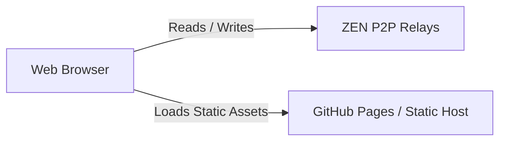

# scobru.dev — Decentralized Linktree Portal

This is the personal website of **Francesco Bruno (scobru)**, a developer and sound designer. This portal is built using **[ZenTree](https://github.com/scobru/zentree)**—a fully open-source, serverless, and decentralized Linktree template that anyone can fork to deploy their own landing page.

Deployed with pure HTML, CSS, and powered by **ZEN**—a decentralized, zero-config graph database.

## Features

- 🌐 **100% Serverless & Static**: Hostable on GitHub Pages, Vercel, Netlify, or any static server for free.
- ⚡ **Dynamic P2P Database**: Powered by [ZEN](https://github.com/akaoio/zen) (a lightweight GunDB wrapper) to fetch and store links dynamically in real-time without a traditional SQL/NoSQL backend.
- 🔒 **Decentralized Authentication**: Secure passwordless cryptographic key generation via Master Credentials (seed-based pair generation).
- 🛠️ **Built-in Admin Panel**: Toggle the hidden **Manage Portal** section at the bottom of the page, authenticate, and instantly add, edit, or delete links dynamically.
- 🎨 **Rich Modern Aesthetics**: Responsive CSS, smooth micro-interactions, dark/light theme switching, and beautiful icon-webfont integration (Tabler Icons).
- 🌱 **One-Click Seeder**: Includes a default "Seed Defaults" button to immediately populate a fresh database node with initial templates.

## Architecture

This portal completely detaches content management from hosting.



All data is stored in the decentralized peer-to-peer graph database across various decentralized relays. When a visitor loads the page:
1. The static HTML is served.
2. A public view cryptographic key fetches the indexed links from the P2P relays.
3. The DOM is rendered and sorted chronologically on-the-fly.

## 🌐 Recommended P2P Relays

This portal is pre-configured to sync across the following recommended decentralized peer-to-peer relays:
- `wss://delay.scobrudot.dev/zen`
- `wss://zen.akao.io:8420/zen`
- `wss://zen0.akao.io:8420/zen`
- `wss://zen1.akao.io:8420/zen`

### 🚀 Spin Up Your Own Relay
To ensure maximum availability, data longevity, and self-sovereignty, you can run your own dedicated peer. Check out the [ZEN Relay Deployment Guide](https://github.com/akaoio/zen#deploy-a-relay-peer) to deploy your own relay with one single command.

## Setup Your Own

1. **Clone the repository**:
   ```bash
   git clone https://github.com/scobru/scobru.github.io.git
   ```

2. **Configure your cryptographic keys**:
   - Open `index.html`.
   - Locate the `<script type="module">` block at the bottom.
   - Replace the `PUBLIC_VIEW_KEY` constant with your own public key:
     ```javascript
     const PUBLIC_VIEW_KEY = 'YOUR_PUBLIC_KEY_HERE';
     ```

3. **Deploy**:
   - Push to your own GitHub repository and enable GitHub Pages, or drop the files onto any static file host.

4. **Initialize Your Links**:
   - Scroll to the bottom of your deployed site, open **Manage Portal**.
   - Input any username and password (this will cryptographically derive your write-keys).
   - Click **Authenticate**.
   - Use the interface to add links, or click **Seed Defaults** to test with pre-filled examples!

## Tech Stack

- **Frontend**: Vanilla HTML5, CSS3 Variables (Light/Dark themes), JavaScript (ES Modules).
- **Database**: [ZEN](https://unpkg.com/@akaoio/zen/zen.min.js) (P2P Graph Database).
- **Icons**: [Tabler Icons Webfont](https://tabler.io/icons).
- **Typography**: Outfit & IBM Plex Mono via Google Fonts.

---
Created by [scobru](https://github.com/scobru) // 2026
